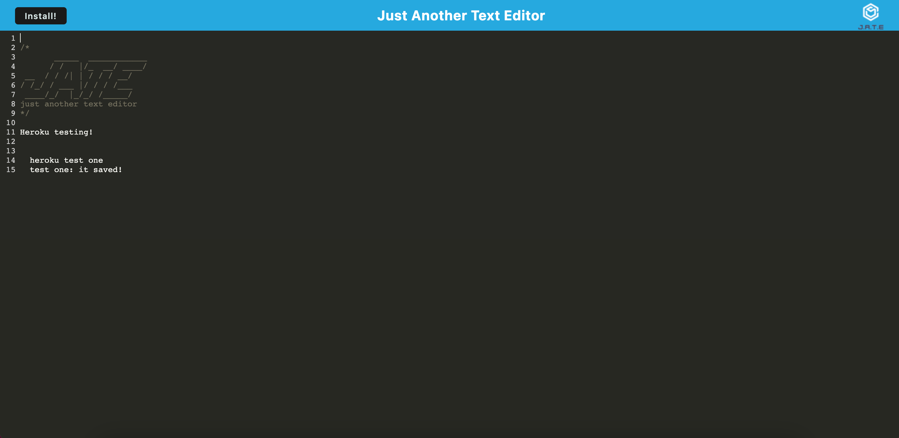

# pwa-text-editor

This program is a PWA text editor called Just Another Text Editor (JATE). The purpose of this program is to have a way to write any form of text through the use of a progressive web application. This means the text editor can be used while no internet connection is available. Using the application is quite straigtforward. Users can type anything into the text editor. The install button on the top left installs the program and then the program will run in a standalone browser window. To test, use the command `npm start`.

## Link to the Deployed Application

https://dock-pwa-text-editor.herokuapp.com/

